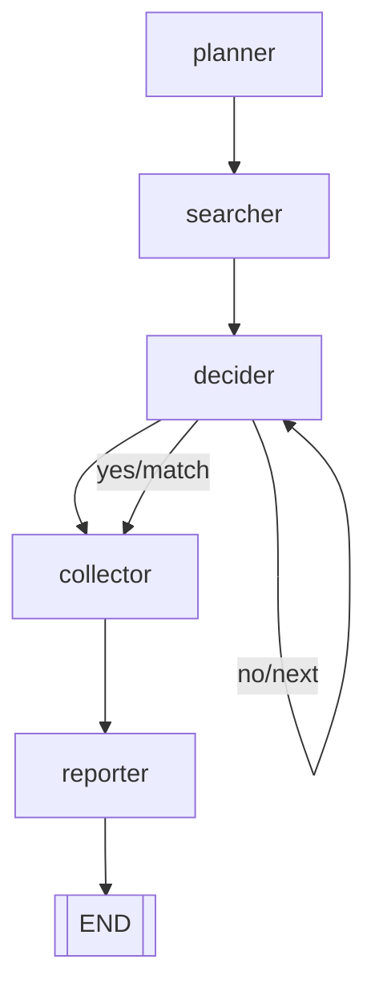
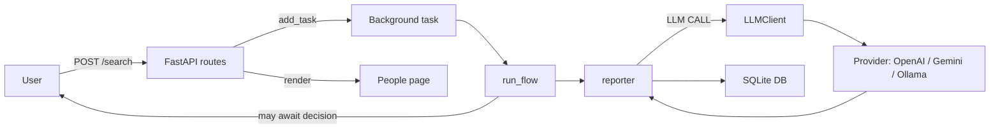

# Search4People

A minimal FastAPI app that helps search for a person's public presence, confirm the best match, collect details, and generate a concise report with help from an LLM. The orchestration logic resembles a simple LangGraph flow.

## Features
- DuckDuckGo search for candidate profiles
- User confirmation loop to select the right candidate
- Detail collection and report generation via pluggable LLM providers (OpenAI, Gemini, or local Ollama)
- Lightweight SQLite persistence
- Simple web UI (Jinja templates)

## LangGraph flow
The flow is implemented procedurally in `src/langgraph_flow.py` but mirrors a `StateGraph` with the following nodes and edges:



- planner: initializes the plan and queries
- searcher: runs web search and prepares candidates
- decider: asks the user to confirm the current candidate or move to next
- collector: enriches details for the confirmed candidate
- reporter: generates a final markdown-like report via the selected LLM provider

### LLM call flow

Below is a sequence diagram showing where calls to the LLM happen in the application lifecycle.



## Getting started

### 1) Requirements
- Python 3.13+
- Windows, macOS, or Linux

### 2) Install dependencies
```
python -m venv .venv
# Windows
.\.venv\Scripts\activate
# Unix
source .venv/bin/activate

pip install -r requirements.txt
```

### 3) Configure environment
Copy `.env.example` to `.env` and fill in values as needed. You only need to configure one LLM provider for best results. If you leave them empty, the app falls back to a deterministic, non-LLM report.

Important variables:
- OPENAI_API_KEY, OPENAI_MODEL (default: gpt-4o-mini)
- GEMINI_API_KEY, GEMINI_MODEL (default: gemini-1.5-flash)
- OLLAMA_MODEL, OLLAMA_HOST (default: http://localhost:11434)
- HOST (default: 127.0.0.1; used when launching `python -m src.app` directly)
- PORT (default: 8000; used when launching `python -m src.app` directly)
- DB_PATH (default: data/search4people.db)

Uvicorn automatically loads `.env` if `python-dotenv` is installed (it is in requirements).

### 4) Run the app
- Windows: `run.bat`
- Unix: `bash run.sh`

Or manually:
```
uvicorn src.app:app --host 127.0.0.1 --port 8000 --reload
```

Then open http://127.0.0.1:8000 in your browser.

## Notes
- If no API keys are configured, report generation uses a fallback that echoes context with a notice. Provide keys for higher-quality summaries.
- Uploaded photos are stored under `data/photos/` and a relative path is saved in the database.
- SQLite DB is created at `data/search4people.db` on first run.

## Project structure (high level)
- `src/app.py`: FastAPI app, routes, and UI wiring
- `src/langgraph_flow.py`: core orchestration logic
- `src/llm.py`: LLM provider abstraction (OpenAI/Gemini/Ollama/fallback)
- `src/tools.py`: search and simple URL title fetcher
- `src/db.py`: very small SQLite layer
- `templates/` and `static/`: UI assets

